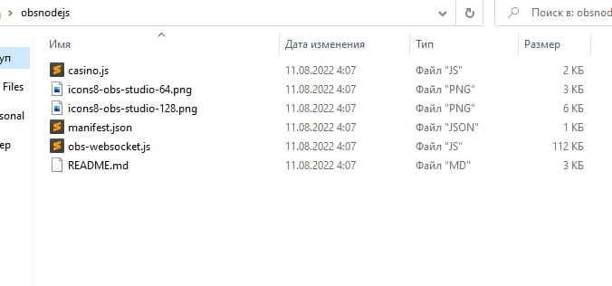
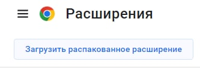
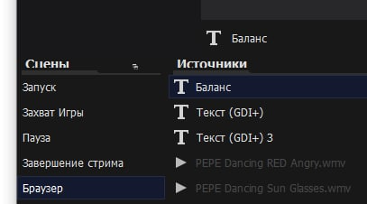

# GOOGLE CHROME РАСШИРЕНИЕ CASINO -> OBS

-----------------------

*Данный скрипт автоматически будет выводить ваш баланс в OBS, когда вы будете играть в казино,
поддерживаемые сайты* : 
**IZZICASINO, DRAGONMONEY, STAKE, VAVADA.**

--------------------

# Инструкция и установка
1. Нам нужен плагин WebSocket для OBS, версии 4.9 (это важно, так как в более новой версии нельзя запустить вебсокет без пароля). 
Скачать можно тут - https://github.com/obsproject/obs-websocket/releases/tag/4.9.1 или  [прямая ссылка на установщик для Windows](https://github.com/obsproject/obs-websocket/releases/download/4.9.1/obs-websocket-4.9.1-Windows-Installer.exe)
+ устанавливаем и **перезапускаем OBS**

2. Скачиваем все файлы моего скрипта и закидываем их в одну папку.

3. Заходим в chrome по ссылке - **chrome://extensions/**
4. Нажимаем **"Загрузить распакованное расширение"** и указываем путь до папки.

6. В OBS создаем источник с названием **"Баланс"**, это **ВАЖНО!** если назовете как то по другому, работать не будет.

7. Готово! Скрипт будет обновлять ваш баланс каждую секунду когда вы играете в казино и у вас открыт OBS.

**Примечание.** Если вдруг у казино проектов поменяется зеркало, такое часто бывает, вам нужно отредактировать ссылку актуального сайта:
1. в **manifest.json** (12 строка)
2. в **casino.js** (12-15 строки, в зависимости от сайта, на котором вы играете)

> Пример, как это будет выглядеть на стриме.

