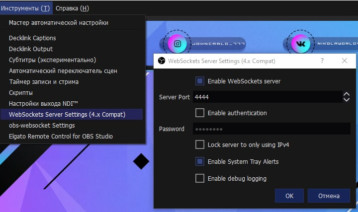

В качестве благодарности, не откажусь от рейда, буду признателен - https://www.twitch.tv/misterx777

Если возникли вопросы - https://vk.com/nikolayorlov77

-----------------------

*Данный скрипт автоматически будет выставлять баланс в вашем OBS, когда вы будете играть в казино
поддерживаемые сайты* : **IZZICASINO, DRAGONMONEY, STAKE, VAVADA.**

--------------------

# Инструкция и установка
1. Нам нужен плагин WebSocket для OBS, версии 4.9 (это важно, так как в более новой версии нельзя запустить вебсокет без пароля). 
Скачать можно тут - https://github.com/obsproject/obs-websocket/releases/tag/4.9.1 или  [прямая ссылка на установщик для Windows](https://github.com/obsproject/obs-websocket/releases/download/4.9.1/obs-websocket-4.9.1-Windows-Installer.exe)
2. Перезаходим в OBS, нажимаем **"Инструменты" > "Websocket Server Settings (4.x Compact)**
3. Выставляем **Server port** : **4444**, Убираем галочку **Enable authentification**, должно получиться как на скрине ниже

2. Скачиваем все файлы моего скрипта и закидываем их в одну папку.
3. Заходим в chrome по ссылке - **chrome://extensions/**
4. Нажимаем **"Загрузить распакованное расширение"** и указываем путь до папки.

6. В OBS создаем источник с названием **"Баланс"**, это **ВАЖНО!** если назовете как то по другому, работать не будет.

7. Готово! Скрипт будет обновлять ваш баланс каждую секунду когда вы играете в казино и у вас открыт OBS.

> Пример, как это будет выглядеть на стриме.

